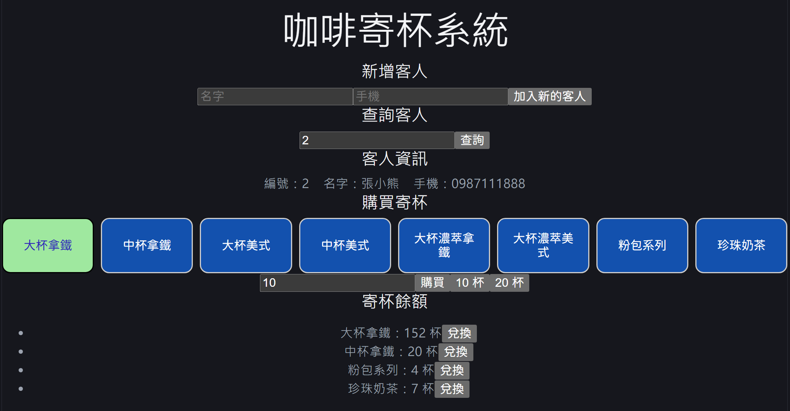

# Prepaid Coffee System｜寄杯咖啡系統

A full-stack prepaid coffee credit management system built with React, Node.js, Express, and SQL.

Designed for real convenience store workflows with mobile-friendly UI and cloud deployment.

一個使用 React、Node.js、Express 和 SQL 建構的全端咖啡寄杯管理系統。

針對真實便利商店流程設計，支援手機操作與雲端部署。

# Live Demo

https://prepaid-coffee-system.vercel.app/

## Features｜功能

- Customer management｜客戶管理
- Coffee item management｜咖啡品項管理
- Prepaid cup balance tracking｜寄杯餘額追蹤
- Purchase and redemption system｜購買與兌換功能
- Transaction history tracking｜交易歷史查詢
- Cloud database synchronization｜雲端資料同步
- Instant balance updates｜即時餘額更新

## Tech Stack｜技術

### Frontend
- React
- Vite
- CSS

### Backend
- Node.js
- Express

### Database
- SQL Server (Local Development)
- PostgreSQL

## Deployment

- Vercel (Frontend)
- Render (Backend)
- Neon (Database)

## Project Structure

```txt
Frontend (React)
        ↓
REST API (Express)
        ↓
PostgreSQL Database (Neon)
```

## Setup

### Environment Variables

Create a `.env` file in the backend folder:

```env
DB_SERVER=localhost\\SQLEXPRESS
DB_DATABASE=Coffee
DB_USER=your_username
DB_PASSWORD=your_password
```

### Frontend

```bash
npm install
npm run dev
```

### Backend

```bash
cd backend
npm install
nodemon server.js
```

## Screenshots



# Future Improvements｜未來規劃

- Authentication system｜登入驗證系統
- Admin dashboard and database management｜管理者模式與資料管理
- Multi-store support｜多店支援
- Version checking and update notification｜版本檢查與更新通知
- Frequently used item prioritization｜熱門品項優先排序
- Transaction analytics｜交易分析
- Offline tablet app version｜平板離線 App 版本